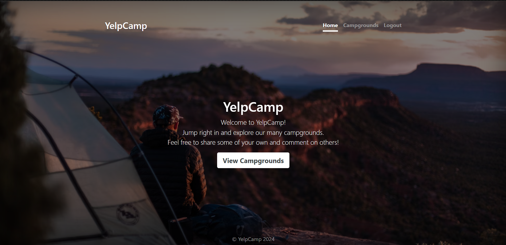
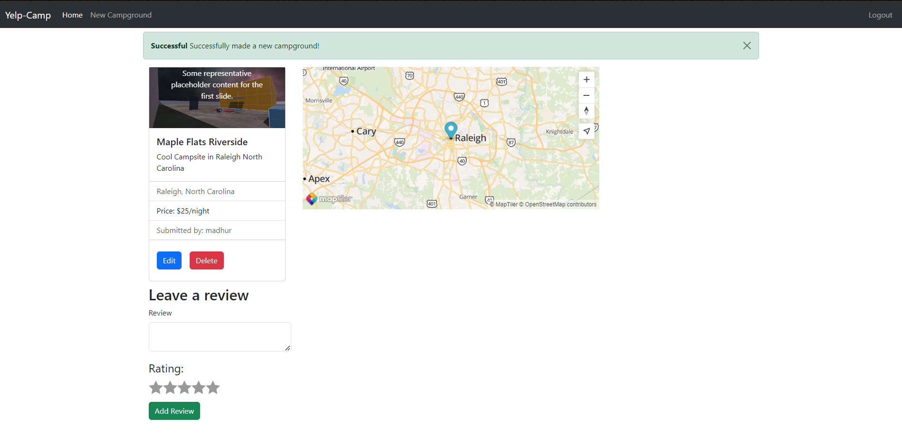
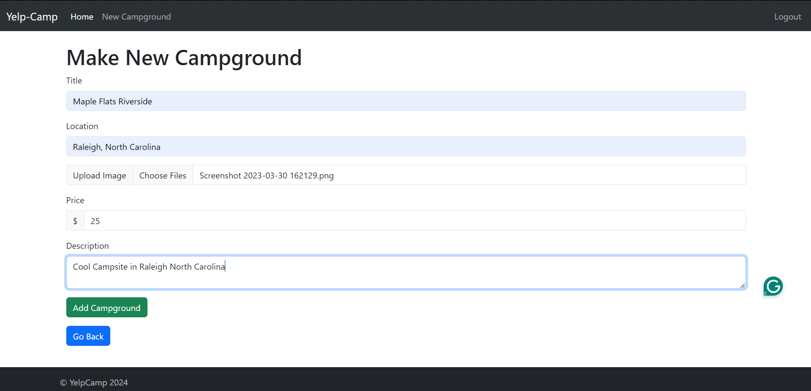

# YelpCamp

Welcome to YelpCamp, a camping review website where users can browse, review, and add campgrounds. This project is part of the Web Development Bootcamp by Colt Steele on Udemy.

## Deployed Application

Check out the deployed version of YelpCamp [here](https://yelpcamp-2etc.onrender.com/).

## Table of Contents
- [Features](#features)
- [Installation](#installation)
- [Usage](#usage)
- [Technologies Used](#technologies-used)
- [Screenshots](#screenshots)
- [Acknowledgements](#acknowledgements)

## Features

- User authentication and authorization
  - Users can sign up, log in, and log out
  - Only authenticated users can add or review campgrounds
  - Users can edit or delete their own campgrounds and reviews
- Campground listings with details and reviews
- Interactive map using MapTiler to display campground locations
- Flash messages for notifications and alerts

## Installation

To run YelpCamp locally, follow these steps:

1. Clone the repository
    ```bash
    git clone https://github.com/yourusername/yelpcamp.git
    ```
2. Navigate to the project directory
    ```bash
    cd yelpcamp
    ```
3. Install the required dependencies
    ```bash
    npm install
    ```
4. Set up environment variables
    - Create a `.env` file in the root directory
    - Add the following environment variables:
      ```
      DATABASE_URL=<your-mongodb-connection-string>
      SECRET=<your-secret-key>
      MAPTILER_KEY=<your-maptiler-key>
      ```

5. Run the application
    ```bash
    npm start
    ```
6. Open your browser and go to `http://localhost:3000`

## Usage

- Browse the home page to see a list of all campgrounds
- Click on a campground to view its details and reviews
- Sign up or log in to add a new campground or leave a review
- Edit or delete your own campgrounds and reviews

## Technologies Used

- Node.js
- Express
- MongoDB
- Mongoose
- Passport for authentication
- MapTiler for maps
- EJS for templating
- Bootstrap for styling
- Cloudinary for image storage
- Multer for file uploads
- Connect-flash for flash messages

## Screenshots

### Home Page


### Campground Details


### Add Campground


## Acknowledgements

- Colt Steele for the fantastic Web Development Bootcamp
- The Udemy community for support and feedback

---

This project is for educational purposes and is part of the Web Development Bootcamp by Colt Steele.
